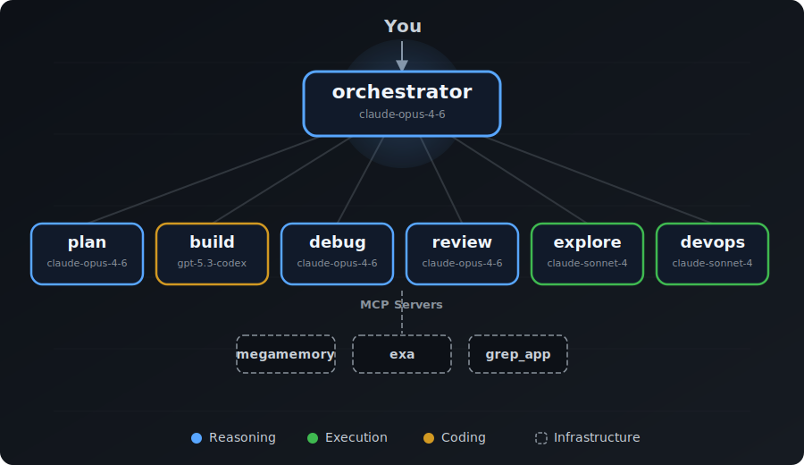

<div align="center">


<p><strong>Route every task to a specialist instead of forcing one assistant to do everything.</strong></p>


<p>
  <a href="#quick-start">Install</a> •
  <a href="#architecture">Architecture</a> •
  <a href="#workflow-examples">Workflows</a> •
  <a href="#model-configuration">Configure</a> •
  <a href="docs/agents.md">Docs</a>
</p>

---

### Quick Start

```bash
curl -fsSL https://raw.githubusercontent.com/0xK3vin/OpenCodeOrchestrator/main/install.sh | bash
```

Configure models (optional):

```bash
curl -fsSL https://raw.githubusercontent.com/0xK3vin/OpenCodeOrchestrator/main/configure.sh | bash
```

</div>

---

## The Problem

A single general-purpose agent can do a little bit of everything, but it usually does none of it exceptionally well. Planning, implementation, debugging, operations, and review need different constraints and different strengths. One prompt and one permission set for all tasks creates inconsistent quality and unnecessary risk.

## The Solution

OpenCode Orchestrator uses role-specialized agents with focused prompts, scoped permissions, and model tiering for cost/capability balance. The orchestrator delegates to the right specialist, chains workflows automatically, and uses persistent megamemory context across sessions. You get better outcomes, lower operational risk, and less prompt micromanagement.

## Architecture

<div align="center">

</div>

## Key Benefits

- **Specialized agents**: Each agent has a focused prompt tuned to one job, scoped permissions (e.g., `build` can edit while `plan` cannot), and a model selected for workload fit.
- **Intelligent routing**: The orchestrator picks the right specialist automatically. Complex features go `plan -> build`; unclear failures go `debug -> build`.
- **Review loop**: Non-trivial changes flow through `review`. If issues are found, they return to `build` until the quality gate passes.
- **Persistent memory via megamemory**: A project knowledge graph survives across sessions; the orchestrator queries before work and records after work.
- **One-line install**: `curl -fsSL https://raw.githubusercontent.com/0xK3vin/OpenCodeOrchestrator/main/install.sh | bash`

## Workflow Examples

<div align="center">

</div>

**Simple code change**

```text
You: "Add a loading spinner to the dashboard"
-> orchestrator -> build -> done
```

**Complex feature (plan -> build -> review)**

```text
You: "Add real-time notifications with WebSocket support"
-> orchestrator -> plan (architecture spec)
                 -> build (implements following plan)
                 -> review (verifies correctness)
                 -> PASS ✓
```

**Bug with unclear cause (debug -> build -> review)**

```text
You: "The checkout flow returns 500 errors intermittently"
-> orchestrator -> debug (traces execution, finds race condition)
                 -> build (implements fix)
                 -> review -> PASS ✓
```

**Review loop (issues found)**

```text
-> review finds missing null check
-> build fixes it
-> review again -> PASS ✓
```

**Codebase question**

```text
You: "How does the auth middleware work?"
-> orchestrator -> explore (read-only analysis with file:line refs)
```

**Deployment**

```text
You: "Deploy to staging"
-> orchestrator -> devops (verifies build, deploys, reports rollback procedure)
```

## Megamemory Integration

`megamemory` is a persistent knowledge graph for your project: features, architecture, patterns, and decisions. It gives your agents memory across sessions.

**Workflow: understand -> work -> update**

- Session start: orchestrator loads project context with memory overview.
- Before tasks: orchestrator queries relevant architecture, patterns, and prior decisions.
- After tasks: orchestrator records new features, decisions, and patterns.

Custom commands included in this repo:

- `/user:bootstrap-memory` - index and bootstrap knowledge for a new project.
- `/user:save-memory` - record what was learned or changed in the current session.

Why it matters: you stop re-explaining your codebase every new session.

## Agent Reference

| Agent | Role | Model | Can Edit | Can Bash | Can Delegate |
|------|------|-------|----------|----------|--------------|
| `orchestrator` | Primary router and synthesis layer | `anthropic/claude-opus-4-6` | No | Yes (deny list) | Yes (to specialists) |
| `plan` | Architecture/spec planning | `anthropic/claude-opus-4-6` | No | No | No |
| `build` | Implementation and tests | `openai/gpt-5.3-codex` | Yes | Yes | No |
| `debug` | Root-cause analysis | `anthropic/claude-opus-4-6` | No | Yes (deny list) | No |
| `devops` | Git, CI/CD, deployments | `anthropic/claude-sonnet-4-20250514` | Yes | Yes (deny list) | No |
| `explore` | Read-only codebase analysis | `anthropic/claude-sonnet-4-20250514` | No | No | No |
| `review` | Validation and quality gate | `anthropic/claude-opus-4-6` | No | Yes (deny list) | No |

## Model Configuration

Use the interactive configurator:

```bash
curl -fsSL https://raw.githubusercontent.com/0xK3vin/OpenCodeOrchestrator/main/configure.sh | bash
```

Presets available:

- `Recommended`: Opus reasoning, Sonnet execution, Codex coding (default profile).
- `All Claude`: Opus reasoning and Sonnet for execution/coding.
- `All OpenAI`: o3 reasoning, GPT-4.1 execution, Codex coding.
- `All Google`: Gemini Pro reasoning/coding with Gemini Flash execution.
- `Budget`: Sonnet everywhere.
- `Custom`: choose models interactively.

Custom mode supports both:

- Per-tier model selection (Reasoning, Execution, Coding).
- Per-agent model selection across all 7 agents.

## File Structure

```text
OpenCodeOrchestrator/
├── README.md
├── install.sh
├── configure.sh
├── LICENSE
├── assets/
│   ├── banner.svg
│   ├── architecture.svg
│   └── workflow.svg
├── config/
│   ├── opencode.json
│   ├── AGENTS.md
│   └── package.json
├── agents/
│   ├── orchestrator.md
│   ├── build.md
│   ├── plan.md
│   ├── debug.md
│   ├── devops.md
│   ├── explore.md
│   └── review.md
├── commands/
│   ├── bootstrap-memory.md
│   └── save-memory.md
└── docs/
    ├── agents.md
    ├── configuration.md
    └── workflows.md
```

Installed layout in `~/.config/opencode/`:

- `opencode.json`, `AGENTS.md`, `package.json`
- `agents/*.md`
- `commands/*.md`
- `docs/*.md`

## Installation

<details>
<summary>Manual Install</summary>

1. Clone this repo.
2. Copy `config/opencode.json` to `~/.config/opencode/opencode.json`.
3. Copy `config/AGENTS.md` to `~/.config/opencode/AGENTS.md`.
4. Copy all `agents/*.md` to `~/.config/opencode/agents/`.
5. Copy all `commands/*.md` to `~/.config/opencode/commands/`.
6. Optionally copy `docs/*.md` to `~/.config/opencode/docs/`.
7. Copy `config/package.json` to `~/.config/opencode/package.json` and run `npm install`.

</details>

Post-install:

- Edit `~/.config/opencode/opencode.json` with your real API keys.
- Optionally run model configuration: `curl -fsSL https://raw.githubusercontent.com/0xK3vin/OpenCodeOrchestrator/main/configure.sh | bash`
- Configure/enable MCP servers you want to use.
- Restart OpenCode.

## Configuration

For full configuration details, see `docs/configuration.md`.

- **Model customization**: tune per-agent `model` values in `agents/*.md`.
- **Permission tuning**: tighten or relax `read/edit/write/bash/task` permissions in frontmatter and `opencode.json`.
- **Adding/removing agents**: update `agents/`, `opencode.json`, and orchestrator routing docs.
- **MCP setup**: configure `mcp` entries in `opencode.json` for local or remote servers.

## Design Decisions

- **Model tiering**: Opus for deep reasoning/review, Sonnet for operational/read-only tasks, Codex for code implementation.
- **DRY tool docs**: tool behavior lives in global skill/tool prompts, not duplicated inside every agent prompt.
- **Bash deny list over allowlist**: broad utility with guardrails against accidental destructive commands.
- **Orchestrator cannot edit**: enforces delegation discipline and clear responsibility boundaries.
- **Review loop quality gate**: non-trivial changes are verified before completion.

## MCP Servers

- `megamemory`: persistent project knowledge graph.

## License

MIT. See `LICENSE`.
